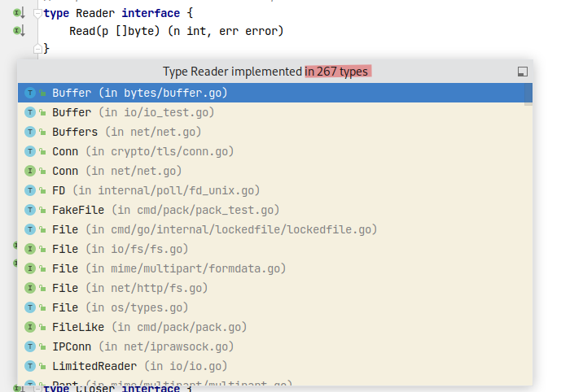

### Интерфейсы в Go

Интерфейсы работают "наизнанку" по сравнению с другими языками:
не нужно явно объявлять, что мой тип реализует интерфейс.
Наоборот: если в типе есть все методы любого чужого интерфейса, значит тип автоматически реализует этот интерфейс.

Из этого можно извлекать классные штуки, особенно полезные для уменьшения связности пакетов и облегчения тестирования.

Рассмотрим пример.
Есть клиент API с большим количеством методов: создать объявление, получить пользователя и т.д.

Как с ним можно работать:
- Создавать этот клиент в каждом месте, где он нужен (см. `advert_1`), или хранить клиент в глобальной переменной.
Минусы таких подходов:
  - скорее всего, для создания клиента нужны всякие опции (хост, путь и т.д.), которые придётся откуда-то брать в каждом месте вызова
  - нельзя подменить реализацию клиента и протестировать пакеты, которые от него зависят

- Объявить под клиент один большой интерфейс и использовать его в других пакетах (см. `advert_1`).
Минусы такого подхода:
  - Если нужно обратиться всего к одному методу API, мы неявно зависим от остальных методов
  - Тяжело написать альтернативные реализации интерфейса: придётся реализовывать каждый метод

Однако наиболее идиоматичен иной подход: 
- Объявить интерфейс в том пакете\файле, где он используется (а не там, где находится его реализация)
- В интерфейсе объявить только те функции, которые нужны здесь и сейчас
- Принимать интерфейс в аргументах функции (или в конструкторе структуры)

См. пример в `advert_3`.
Плюсы такого подхода :
- Можно легко подменить реализацию интерфейса
- Можно подключить стороннюю библиотеку, которая автоматически будет реализовывать описанный вами интерфейс
- Можно легко написать тест, написав в нём краткую реализацию интерфейса
- Уменьшается связность пакетов: обратите внимание, что в `advert_3/search.go` вообще не подключается пакет `api_client`

В самом языке Go такой подход используется повсеместно. Самые яркие примеры - интерфейсы `io.Reader` и `io.Writer`, которые неявно реализуются во множестве мест (как в стандартной библиотеке, так и во множестве сторонних).

---------

На секунду отступим от интерфейсов и поговорим о внедрении зависимостей.

В последнем подходе в директории `advert_3` есть одно неудобство: чтобы найти объявления, в функцию `FindAdvertsByQuery` каждый раз нужно прокидывать интерфейс `AdvertStorage`. Получается, все, кто вызывает эту функцию, должны уметь создавать или откуда-то получать `AdvertStorage`. Как можно сделать удобнее?

Если проанализировать функцию `FindAdvertsByQuery`, мы увидим, что она принимает 2 очень разных аргумента:
- `query` - поисковый запрос. Это важная часть бизнес-логики программы - способность искать объявления по запросу.
- `advertStorage` - служебная зависимость. Это чисто "технический" аргумент, не имеющий отношения к бизнес-логике.
- помимо `advertStorage`, функции поиска может понадобиться что-то типа `elasticsearchClient`, `cache`, `logger` и т.д. Замучаемся передавать их в аргументах!

У аргументов `query` и `advertStorage` есть ещё одно отличие: время жизни.
Ведь скорее всего в процессе исполнения в программу будет приходить множество разных запросов. Однако хранилище объявлений, скорее всего, понадобится создать только 1 раз и во время исполнения оно меняться не будет.

Поэтому лучше сделать так: 
- отделим служебные зависимости от бизнес-логики. Для этого спрячем их в структуру, а в методе структуры оставим только реально нужные аргументы. 
- назовём эту структуру, например, `AdvertFinder`. У неё останется метод `FindAdvertsByQuery`, но принимать он будет только то, что важно по бизнес-логике: поисковый запрос. 
- создадим клиент API один раз (например, при старте программы)
- затем подготовим `AdvertFinder`, передав ему клиент API в качестве хранилища объявлений: `var finder = NewAdvertFinder(apiClient)`
- в дальнейшем будем вызывать поиск объявлений через `finder.FindAdvertsByQuery("cars")`

Такой подход легко масштабируется: зависимости можно вкладывать друг в друга. Другой пакет может объявить интерфейс `AdvertFinder` и принимать его реализацию как свою зависимость, и так далее.

Так можно построить программу с глубокими "древовидными" зависимостями. Её компоненты не будут знать о реализациях друг друга. "Неявная" реализация интерфейсов в go сильно способствует применению такого подхода.

### Выводы

* Как и в PHP и других языках, интерфейсы позволяют подменять реализацию компонентов программ. И делают возможным написание юнит-тестов.
* Объявляйте интерфейсы там, где вам нужно подключить стороннюю зависимость. А не там, где находится сама зависимость.
* Используйте маленькие интерфейсы (идеальный пример - `io.Reader`)
* Используйте структуры, чтобы хранить в них служебные зависимости (которые вполне могут быть интерфейсами).
  * Вместо `findAdvert("toyota camry", advertStorage, cache, elaticsearch)` используйте `finder.findAdvert("toyota camry")`, где служебные зависимости спрятаны внутри структуры `finder`